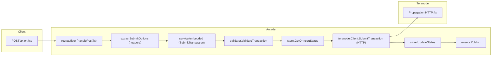
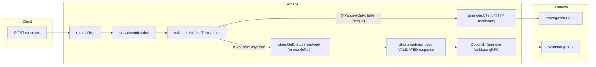
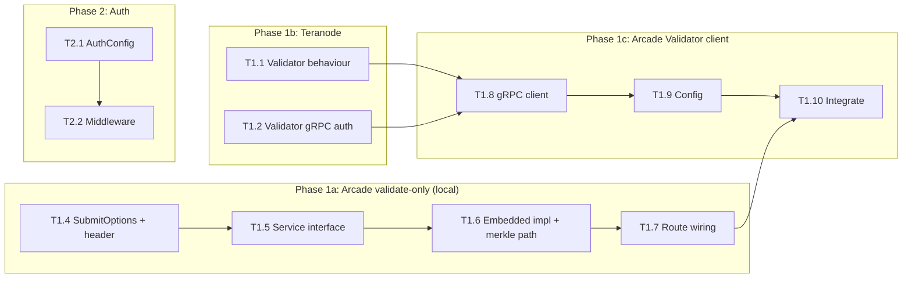

# Implementation Plan: Signed, Secure Broadcast & Validate-Only (Arcade + Teranode)

This document is the **execution plan** for implementing secure broadcast and validate-only (spend-simulation) capabilities across **Arcade** ([bsv-blockchain/arcade](https://github.com/bsv-blockchain/arcade)) and **Teranode** ([bsv-blockchain/teranode](https://github.com/bsv-blockchain/teranode)).

**Arcade replaces ARC** as the next-generation transaction broadcaster for Teranode. It is simpler (single binary, SQLite, P2P-first) and already designed for Teranode. This plan supersedes the ARC-based [IMPLEMENTATION_PLAN.md](./IMPLEMENTATION_PLAN.md).

All design rationale and original research are in **[BROADCAST_RESEARCH_AND_PLAN.md](./BROADCAST_RESEARCH_AND_PLAN.md)**.

---

## Goals

1. **Validate-only (simulate)** – Client sends a tx with `X-ValidateOnly: true`; Arcade validates locally, optionally calls Teranode Validator gRPC with `add_tx_to_block_assembly=false` for UTXO spent check, returns result **without broadcast**. If the tx is already mined, return its current `merklePath` for BEEF/BUMP refresh.
2. **Signed and secure broadcast** – Strengthen existing auth (currently single bearer token), add multi-token/API-key support, optional request signing, and TLS for the Arcade API.
3. **Secure Arcade ↔ Teranode** – Ensure Teranode Validator gRPC accepts `x-api-key` auth; Arcade connects over TLS with API key.

---

## Arcade architecture (current)

### Key files

| Area | File | Notes |
|------|------|-------|
| Routes | `routes/fiber/routes.go` | Fiber handlers: `handlePostTx`, `handlePostTxs`, `extractSubmitOptions` |
| Service interface | `service/interface.go` | `ArcadeService`: `SubmitTransaction`, `SubmitTransactions`, `GetStatus`, `Subscribe`, `GetPolicy` |
| Embedded service | `service/embedded/embedded.go` | Core logic: parse → validate → store → broadcast → update status |
| Teranode client | `teranode/client.go` | HTTP-only: `SubmitTransaction(ctx, endpoint, rawTx)` → `POST {endpoint}/tx` |
| Local validator | `validator/validator.go` | Policy + fee + script validation (uses go-sdk SPV) |
| Models | `models/transaction.go` | `TransactionStatus`, `SubmitOptions`, `Status` enum, `HexBytes` (merkle path) |
| Config | `config/config.go` | `Config` with `AuthConfig{Enabled, Token}`, `TeranodeConfig{BroadcastURLs, AuthToken}`, `ServerConfig`, etc. |
| Store | `store/store.go` | SQLite: `GetOrInsertStatus`, `UpdateStatus`, `GetStatus`, `InsertMerklePath`, `SetMinedByBlockHash` |
| Auth middleware | `cmd/arcade/main.go` | `authMiddleware(token)` — single bearer token, skips health/policy/docs |

### What Arcade already has vs what's missing

| Capability | Status |
|------------|--------|
| Local tx validation (policy, fees, scripts) | **Exists** (`validator/validator.go`) |
| Idempotent tx submission (returns existing if known) | **Exists** (`store.GetOrInsertStatus`) |
| Merkle path storage and return | **Exists** (`store.InsertMerklePath`, `TransactionStatus.MerklePath`) |
| Single bearer token auth | **Exists** (`auth.enabled`, `auth.token`) |
| Teranode HTTP broadcast | **Exists** (`teranode/client.go`) |
| Validate-only flag (`X-ValidateOnly`) | **Missing** |
| Teranode Validator gRPC client | **Missing** — Arcade only has HTTP broadcast client |
| Multi-token / API-key auth | **Missing** — only single token |
| TLS for Arcade API | **Missing** — Fiber uses plain HTTP |
| Request signing | **Missing** |

---

## Architecture: validate-only vs broadcast (proposed)

---

## Phase 1 – Validate-only (simulate) flow

### 1.1 Teranode

| # | Task | Repo | Details |
|---|------|------|---------|
| T1.1 | Confirm Validator validate-only behaviour | Teranode | In `services/validator/Server.go`: when `add_tx_to_block_assembly=false`, full validation (format, UTXO lookup, script checks) still runs but block assembly send is skipped. **Do not** set `skip_utxo_creation=true` for this path — we want the UTXO spent check. Confirm this works as expected and document in Validator docs. |
| T1.2 | Add gRPC auth to Validator | Teranode | Currently Validator starts with `authOptions = nil` (no auth, `Server.go` line 381). Other Teranode services use `x-api-key` via `util.CreateAuthInterceptor`. Add optional `x-api-key` auth to the Validator gRPC server: read from settings (e.g. `validator.grpc_api_key`), pass to `StartGRPCServer` as auth interceptor. |
| T1.3 | (Optional) Response signing | Teranode | If required: add Validator response signing. For MVP, TLS + API key is sufficient. |

### 1.2 Arcade – validate-only header and options

| # | Task | Repo | Details |
|---|------|------|---------|
| T1.4 | Add `ValidateOnly` to `SubmitOptions` and header parsing | Arcade | **1)** In `models/transaction.go`: add `ValidateOnly bool` to `SubmitOptions` and a new status `StatusValidated = Status("VALIDATED")`. **2)** In `routes/fiber/routes.go`, in `extractSubmitOptions`: read `X-ValidateOnly` header and set `opts.ValidateOnly`. **3)** Add `X-ValidateOnly` to the Swagger annotations on `handlePostTx` and `handlePostTxs`. |
| T1.5 | Add `ValidateTransaction` to `ArcadeService` interface | Arcade | In `service/interface.go`, add: `ValidateTransaction(ctx, rawTx, opts) (*TransactionStatus, error)` and `ValidateTransactions(ctx, rawTxs, opts) ([]*TransactionStatus, error)`. This keeps validate-only separate from submit at the interface level. |
| T1.6 | Implement validate-only in embedded service | Arcade | In `service/embedded/embedded.go`, implement `ValidateTransaction` / `ValidateTransactions`: **1)** Parse tx (BEEF then raw, same as `SubmitTransaction`). **2)** Run `txValidator.ValidateTransaction(ctx, tx, ...)`. **3)** **DB lookup for merkle path:** call `store.GetStatus(ctx, txid)`. If found and status is `MINED` or `IMMUTABLE` with a non-empty `MerklePath`, carry that into the response — this lets clients refresh stale BEEFs/BUMPs after a reorg. **4)** Build response: `TransactionStatus{TxID, Status: StatusValidated, MerklePath (if mined), BlockHash, BlockHeight}`. **5)** Do **not** call `store.GetOrInsertStatus` (don't persist the validate-only request), do **not** broadcast. **6)** Optionally call Teranode Validator (T1.9) and merge result. |
| T1.7 | Route validate-only requests | Arcade | In `routes/fiber/routes.go`, in `handlePostTx` / `handlePostTxs`: when `opts.ValidateOnly`, call `r.service.ValidateTransaction` / `r.service.ValidateTransactions` instead of `SubmitTransaction` / `SubmitTransactions`. |

### 1.3 Arcade – Teranode Validator gRPC client

| # | Task | Repo | Details |
|---|------|------|---------|
| T1.8 | Create Teranode Validator gRPC client | Arcade | Arcade has **no** proto or gRPC client for Teranode's Validator. **1)** Vendor the proto from `teranode/services/validator/validator_api/validator_api.proto` (and its dependency `teranode/errors/error.proto`) into `arcade/teranode/validator_api/`. **2)** Generate Go code via `protoc` (or buf). **3)** Create `arcade/teranode/validator_client.go` with a `ValidatorClient` struct holding a `*grpc.ClientConn` and exposing: `ValidateTransaction(ctx, rawTx) (*ValidateResult, error)` and `ValidateTransactionBatch(ctx, rawTxs) ([]*ValidateResult, error)`. Requests use `add_tx_to_block_assembly=false` only (do not set `skip_utxo_creation`). **4)** Accept TLS config and API key; attach `x-api-key` via `metadata.AppendToOutgoingContext`. |
| T1.9 | Config for Validator client | Arcade | In `config/config.go`, add to `TeranodeConfig`: `ValidatorGRPCAddr string`, `ValidatorAPIKey string`, `ValidatorFailClosed bool` (mapstructure tags: `validator_grpc_addr`, `validator_api_key`, `validator_fail_closed`). Set defaults: empty addr (disabled), empty key, `fail_closed: false`. |
| T1.10 | Integrate Validator in validate-only path | Arcade | In `service/embedded/embedded.go`, in `ValidateTransaction` / `ValidateTransactions`: **1)** If Validator is configured (`ValidatorGRPCAddr` non-empty), after local validation: call `ValidatorClient.ValidateTransaction` (single) or `ValidateTransactionBatch` (batch). **2)** Merge result into response: add `NodeValidation *NodeValidationResult` to `TransactionStatus` (with `Valid bool`, `Reason string`). **3)** **Fallback:** If Validator is unreachable and `fail_closed=false` (default): return local validation result with `NodeValidationUnavailable: true`. If `fail_closed=true`: return error. |

### 1.4 Arcade – Merkle path refresh for already-mined txs

| # | Task | Repo | Details |
|---|------|------|---------|
| T1.11 | Return merkle paths for already-mined txs | Arcade | Already covered in T1.6 step 3. The validate-only path calls `store.GetStatus` to find existing tx info. If the tx is mined, include `MerklePath`, `BlockHash`, `BlockHeight` in the `VALIDATED` response. This serves dual purpose: (a) "is this tx valid / are its UTXOs unspent?" and (b) "if already mined, here's the latest proof" — covering the reorg/BEEF refresh use case. No schema change needed; `TransactionStatus` already has these fields. |

**Deliverable:** Clients send `X-ValidateOnly: true` and get validation result without broadcast; already-mined txs include current merkle path; when Teranode Validator is configured, UTXO spent check is included; fallback is configurable.

---

## Phase 2 – Strengthen authentication

**Goal:** Multi-token/API-key auth for Arcade API.

### 2.1 Arcade

| # | Task | Repo | Details |
|---|------|------|---------|
| T2.1 | Extend `AuthConfig` | Arcade | In `config/config.go`, extend `AuthConfig`: add `Mode string` (`"bearer"`, `"apikey"`, `"none"`), `BearerTokens []string`, `APIKeys []string`. Keep backward-compat: if `Token` (single) is set and `BearerTokens` is empty, treat `Token` as the sole bearer token. Set defaults: `mode: "bearer"`, empty lists. |
| T2.2 | Update auth middleware | Arcade | In `cmd/arcade/main.go`, update `authMiddleware`: **1)** When `mode=bearer`: check `Authorization: Bearer <token>` against `BearerTokens` list (constant-time compare). **2)** When `mode=apikey`: check `X-API-Key` header against `APIKeys` list. **3)** Keep skip-list for `/health`, `/policy`, `/docs`. **4)** Return 401 with consistent error body. |
| T2.3 | Document auth config | Arcade | Update `config.example.yaml` and README with multi-token examples. |

**Deliverable:** Operators can configure multiple bearer tokens or API keys.

---

## Phase 3 – TLS and optional request signing

### 3.1 Arcade

| # | Task | Repo | Details |
|---|------|------|---------|
| T3.1 | TLS for Fiber server | Arcade | Arcade uses Fiber. In `config/config.go`, add `TLS TLSConfig` to `ServerConfig` with `CertFile string`, `KeyFile string`. In `cmd/arcade/main.go`, when both are set, use Fiber's `app.ListenTLS(addr, certFile, keyFile)` instead of `app.Listen(addr)`. Document in config example. Alternatively, document reverse-proxy as the recommended production TLS approach. |
| T3.2 | (Optional) Request signing middleware | Arcade | If required: add HMAC request signing (`X-Signature`, `X-Timestamp`, `X-Nonce`), config `auth.request_signing_required`, Fiber middleware to validate. |

### 3.2 Arcade ↔ Teranode

| # | Task | Repo | Details |
|---|------|------|---------|
| T3.3 | TLS for Validator gRPC | Arcade | In `teranode/validator_client.go`: use `credentials.NewTLS(&tls.Config{})` when `ValidatorGRPCAddr` uses a TLS endpoint. Optionally add `ValidatorTLSEnabled bool` to config. |
| T3.4 | TLS for broadcast HTTP | Arcade | Already handled: `teranode.Client` uses `http.Client` which respects `https://` URLs. Document that production broadcast URLs should use HTTPS. |

**Deliverable:** Arcade API can serve over TLS; Arcade→Teranode Validator uses TLS + API key.

---

## Phase 4 – Teranode operational and docs

| # | Task | Repo | Details |
|---|------|------|---------|
| T4.1 | Document validate-only use case | Teranode | In Validator docs: describe `ValidateTransaction` / `ValidateTransactionBatch` with `add_tx_to_block_assembly=false` for spend-simulation. State that `skip_utxo_creation` should remain false/omitted. |
| T4.2 | Document gRPC auth for Validator | Teranode | Document `x-api-key` auth (added in T1.2) and TLS. |
| T4.3 | Security and firewall | Teranode | Align with existing [Security Best Practices](https://bsv-blockchain.github.io/teranode/howto/miners/docker/minersSecurityBestPractices/): Validator behind TLS and firewall. |

---

## Dependency order

1. **Phase 1a (Arcade validate-only, local only):** T1.4 → T1.5 → T1.6 → T1.7.
2. **Phase 1b (Teranode):** T1.1, T1.2 (can run in parallel with 1a).
3. **Phase 1c (Arcade Validator client):** T1.8 → T1.9 → T1.10 (depends on 1a + 1b).
4. **Phase 2:** T2.1 → T2.2 → T2.3 (independent of Phase 1).
5. **Phase 3:** T3.1, T3.2, T3.3 (after Phase 2).
6. **Phase 4:** T4.1–T4.3 (alongside 1–3).

---

## Testing and acceptance

- **Validate-only (local):** `POST /tx` with `X-ValidateOnly: true` and a valid tx → `txStatus: "VALIDATED"`, no broadcast to Teranode.
- **Validate-only (invalid tx):** Submit an invalid tx → validation error, no broadcast.
- **Merkle path refresh:** Submit an already-mined tx with `X-ValidateOnly: true` → response includes `txStatus: "VALIDATED"` **and** current `merklePath`, `blockHash`, `blockHeight`. After a simulated reorg, the returned merkle path reflects the new block.
- **Teranode Validator:** With Validator configured, validate-only includes `nodeValidation: {valid, reason}` from Teranode UTXO check.
- **Validator unreachable:** With `fail_closed: false`, Validator down → ARC-only result + `nodeValidationUnavailable: true`.
- **Auth (multi-token):** With auth enabled and multiple tokens, valid token → 200; invalid token → 401.
- **TLS:** Verify Arcade API serves over TLS when configured; Arcade→Teranode Validator uses TLS.
- **Backward compat:** With no new headers and auth disabled, existing clients work unchanged.

---

## Comparison: Arcade vs ARC

| Aspect | ARC | Arcade |
|--------|-----|--------|
| Framework | Echo + oapi-codegen | Fiber |
| Teranode comms | gRPC to Metamorph → P2P | HTTP to Propagation + P2P gossip |
| Storage | PostgreSQL + NATS | SQLite (single binary) |
| Auth | None (must be added) | Single bearer token (must extend) |
| Codegen | `task api` + `scripts/generate_docs.sh` from `arc.yaml` | Swagger annotations in Go (no separate yaml codegen) |
| Validate-only | Must be added | Must be added |
| Teranode Validator client | Must be created | Must be created |
| Merkle path support | Exists in `TransactionStatus.MerklePath` | Exists in `TransactionStatus.MerklePath` |

Arcade is the recommended path forward — simpler deployment, purpose-built for Teranode, actively maintained.

---

## Summary

### Goal

Enable **signed, secure, validate-only transaction checking** through Arcade + Teranode. A client sends a transaction with `X-ValidateOnly: true` and receives a validation result — including UTXO spent status from Teranode's Validator — **without** the transaction being broadcast to the network. If the transaction is already mined, the response includes the current merkle path so clients can refresh stale BEEFs/BUMPs after chain reorgs. All communication (client → Arcade → Teranode) is authenticated and encrypted.

### Implementation sequence

| Step | What | Where | Outcome |
|------|------|-------|---------|
| **1** | Add `X-ValidateOnly` header, `ValidateOnly` option, `VALIDATED` status | Arcade: `models/`, `routes/fiber/` | Header is parsed and available to the service layer |
| **2** | Add `ValidateTransaction` / `ValidateTransactions` to service interface | Arcade: `service/interface.go` | Clean separation of validate-only from submit |
| **3** | Implement validate-only: local validation + DB lookup for merkle path (no broadcast, no persist) | Arcade: `service/embedded/embedded.go` | Clients get `VALIDATED` response with merkle path if tx is already mined |
| **4** | Wire routes: dispatch to validate or submit based on `ValidateOnly` flag | Arcade: `routes/fiber/routes.go` | End-to-end validate-only works with local validation |
| **5** | *(parallel)* Confirm Validator behaviour with `add_tx_to_block_assembly=false`; add `x-api-key` auth | Teranode: `services/validator/` | Validator does full UTXO check without broadcast; gRPC is auth-protected |
| **6** | Create Teranode Validator gRPC client (vendor proto, generate Go, build wrapper) | Arcade: `teranode/validator_client.go` | Arcade can call Validator with TLS + API key |
| **7** | Add Validator config (`validator_grpc_addr`, `validator_api_key`, `validator_fail_closed`) | Arcade: `config/config.go` | Validator integration is configurable |
| **8** | Integrate Validator into validate-only path with fallback (fail-open / fail-closed) | Arcade: `service/embedded/embedded.go` | UTXO spent check from Teranode in validate-only response; graceful fallback |
| **9** | Extend auth: multi-token bearer + API key modes | Arcade: `config/`, `cmd/arcade/main.go` | Operators can issue multiple credentials |
| **10** | Add TLS for Arcade API (Fiber `ListenTLS`) and document HTTPS for Teranode broadcast URLs | Arcade: `config/`, `cmd/arcade/main.go` | All traffic encrypted in production |
| **11** | *(optional)* Request signing middleware (HMAC + timestamp + nonce) | Arcade: new middleware | High-assurance clients can sign requests |
| **12** | Document validate-only, gRPC auth, and security best practices | Teranode: docs | Operators and integrators have clear guidance |

Steps 1–4 deliver a working validate-only endpoint with local validation and merkle path refresh. Steps 5–8 add Teranode UTXO checking. Steps 9–12 harden security. Steps 1–4 and 5 can run in parallel; step 6 depends on step 5.

---

## Reference

- **Research and design:** [BROADCAST_RESEARCH_AND_PLAN.md](./BROADCAST_RESEARCH_AND_PLAN.md)
- **ARC plan (superseded):** [IMPLEMENTATION_PLAN.md](./IMPLEMENTATION_PLAN.md)
- **Arcade:** [bsv-blockchain/arcade](https://github.com/bsv-blockchain/arcade)
- **Teranode:** [bsv-blockchain/teranode](https://github.com/bsv-blockchain/teranode)
- **Teranode Validator Proto:** `teranode/services/validator/validator_api/validator_api.proto`
