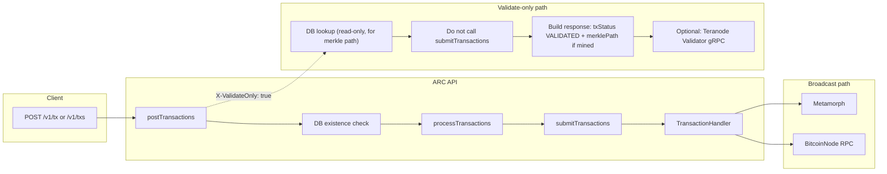
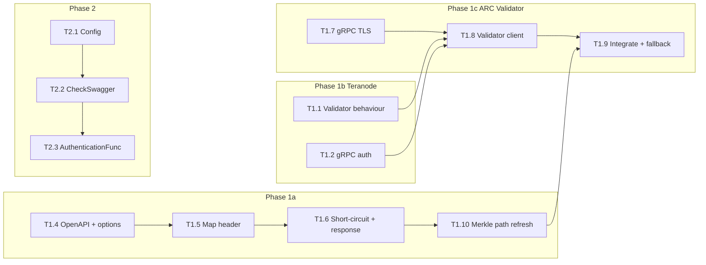

# Implementation Plan: Signed, Secure Broadcast & Validate-Only (ARC + Teranode)

This document is the **execution plan** to implement the changes across **ARC** (bitcoin-sv/arc) and **Teranode** (bsv-blockchain/teranode) so we can achieve:

1. **Signed and secure broadcast** – Authenticated (and optionally request-signed) access to ARC's broadcast API, with TLS and Teranode as the node backend when needed.
2. **Validate-only (simulate)** – An ARC option to run spend-simulation only (no broadcast), returning UTXO spent status by calling Teranode's Validator with `add_tx_to_block_assembly=false`.

All design rationale and research are in **[BROADCAST_RESEARCH_AND_PLAN.md](./BROADCAST_RESEARCH_AND_PLAN.md)**. This plan is task-oriented, with precise file paths and codegen steps.

---

## OpenAPI / codegen workflow (ARC)

- **Source of truth:** [arc/pkg/api/arc.yaml](arc/pkg/api/arc.yaml). Do **not** edit [arc/pkg/api/arc.go](arc/pkg/api/arc.go) by hand; it is generated by **oapi-codegen** v2.4.1.
- **After any change to `arc.yaml`:**
  1. Run `task api` (from ARC repo root) to regenerate `pkg/api/arc.go`.
  2. Run `scripts/generate_docs.sh` to regenerate `pkg/api/arc.json` and `doc/arc.json`.
- **Single-tx vs batch:** `POST /v1/tx` delegates to the same `postTransactions` as `POST /v1/txs` (params are cast to `POSTTransactionsParams`). There is only **one** options parser: `getTransactionsOptions`. Adding a header once in the OpenAPI spec covers both endpoints.

---

## Architecture: validate-only vs broadcast

When `X-ValidateOnly: true`: skip the normal DB-gated skip/re-submit logic, but **do** perform a read-only DB lookup for existing tx status. If the tx is already mined, include its current `merklePath` (and `blockHash`, `blockHeight`) in the response alongside `txStatus: "VALIDATED"`. Then run validation (no `submitTransactions`), optionally call Teranode Validator for UTXO check, and return.

---

## Repos and roles

| Repo | Role in this plan |
|------|-------------------|
| **ARC** (bitcoin-sv/arc) | Broadcast API, auth enforcement, validate-only flag, Teranode Validator gRPC client for UTXO check, TLS for API and gRPC. |
| **Teranode** (bsv-blockchain/teranode) | Node/Validator backend: RPC for broadcast, Validator gRPC for validate-only (spend-simulation). Confirm/add support for validate-only semantics and gRPC auth. |

---

## Phase 1 – Validate-only (simulate) flow

**Goal:** Client can call ARC with a flag to get spend-simulation only (no broadcast), with optional UTXO spent status from Teranode.

### 1.1 Teranode

| # | Task | Repo | Details |
|---|------|------|--------|
| T1.1 | Confirm Validator validate-only behaviour | Teranode | Ensure `ValidateTransaction` / `ValidateTransactionBatch` with **`add_tx_to_block_assembly=false`** performs full validation including **UTXO spent check** and does not broadcast or add to block assembly. Do **not** use `skip_utxo_creation=true` for this path. Document a short "validate-only / spend-simulation" note in Validator docs. |
| T1.2 | Confirm gRPC auth for Validator | Teranode | Verify Validator gRPC accepts **`x-api-key`** (or equivalent) in metadata. If not, add support so ARC can call over TLS with an API key. Document in Validator or security docs. |
| T1.3 | (Optional) Response signing | Teranode | If required: confirm whether Validator returns a signature over the response payload; if not, add or document a follow-up. For MVP, TLS + API key is acceptable. |

### 1.2 ARC – validate-only (no Teranode client yet)

| # | Task | Repo | Details |
|---|------|------|--------|
| T1.4 | Add `ValidateOnly` to options and OpenAPI | ARC | **1)** In [arc/internal/global/types.go](arc/internal/global/types.go), add `ValidateOnly bool` to `TransactionOptions` (around line 73). **2)** In [arc/pkg/api/arc.yaml](arc/pkg/api/arc.yaml): under `components/parameters`, add a new parameter (e.g. `validateOnly`) with `name: X-ValidateOnly`, `in: header`, `schema: type: boolean`. **3)** Add `- $ref: '#/components/parameters/validateOnly'` to the `parameters` list of both `POST /v1/tx` and `POST /v1/txs` (they share the same parameter refs). **4)** Add a new enum value **`VALIDATED`** to `TransactionDetails.txStatus` enum (in `components/schemas/TransactionDetails`, around line 599) for validate-only success responses. **5)** Run `task api` and `scripts/generate_docs.sh` to regenerate `arc.go` and `arc.json`. |
| T1.5 | Map header to options | ARC | In [arc/internal/api/handler/default.go](arc/internal/api/handler/default.go), in **`getTransactionsOptions`** only (there is no separate single-tx options function; single-tx reuses this via `POSTTransactionsParams`): when `params.XValidateOnly != nil && *params.XValidateOnly`, set `transactionOptions.ValidateOnly = true`. Mirror the pattern used for `XForceValidation` (lines 589–592). |
| T1.6 | Short-circuit in `postTransactions` and validate-only response | ARC | **1)** In **`postTransactions`** ([arc/internal/api/handler/default.go](arc/internal/api/handler/default.go)), immediately after parsing `transactionOptions`: if `transactionOptions.ValidateOnly` is true, **skip the normal DB-gated skip/resubmit logic** (lines 412–434) but still perform a **read-only** `getTransactionStatuses` lookup (see T1.10). Then call `processTransactions` with the same options. **2)** In **`processTransactions`**, when `options.ValidateOnly` is true: after `getTxDataFromHex` succeeds, **do not** call `submitTransactions`. Build success responses using the same `TransactionResponse` shape but set `txStatus` to the new **`VALIDATED`** enum value; reuse existing error/`fails` structure for validation failures. **3)** Merge in any existing `merklePath`, `blockHash`, `blockHeight` from the DB lookup (T1.10) for txs that are already mined. **4)** Return that response from `postTransactions` without merging with submit results. **5)** Document the validate-only response in the API docs: success = `txStatus: "VALIDATED"`, with `merklePath` populated when the tx is already mined; when Teranode Validator is used (T1.9), add an optional **`nodeValidation`** object per tx with `valid` (bool) and `reason` (string) from Teranode. |
| T1.10 | Return merkle paths for already-mined txs (BEEF/BUMP refresh) | ARC | **Rationale:** After a chain reorg, previously broadcast BEEFs and BUMPs may reference a stale block. Clients re-submitting (or validate-only checking) a tx should receive the **current** merkle path if the tx has been (re-)mined. **1)** In the validate-only path of `postTransactions`, after `getTxIDs` but before `processTransactions`: call `getTransactionStatuses(reqCtx, txIDs)`. This is a read-only check — do **not** use it to skip validation or short-circuit as the broadcast path does. **2)** For each tx that is found with status `MINED` (or `SEEN_ON_NETWORK` etc.) and has a non-empty `MerklePath`: carry that data forward and merge it into the validate-only `TransactionResponse` (set `merklePath`, `blockHash`, `blockHeight` on the response item). **3)** This ensures the validate-only endpoint is dual-purpose: (a) "is this tx valid / are its UTXOs unspent?" and (b) "if it's already mined, give me the latest proof". **4)** No OpenAPI schema change needed — `TransactionResponse` already includes `merklePath`, `blockHash`, `blockHeight` fields. |

### 1.3 ARC – gRPC TLS and metadata auth (prerequisite for Validator client)

| # | Task | Repo | Details |
|---|------|------|--------|
| T1.7 | Extend gRPC dial with TLS and optional metadata | ARC | [arc/internal/grpc_utils/connection.go](arc/internal/grpc_utils/connection.go) currently uses `DialGRPC` with no TLS (see [arc/internal/grpc_utils/opts.go](arc/internal/grpc_utils/opts.go): `insecure.NewCredentials()`). Add a new function (e.g. `DialGRPCWithTLS` or extend `DialGRPC` with optional `*TLSConfig` and `metadata.MD`) that: (a) uses `credentials.NewTLS(tlsConfig)` when TLS is configured, (b) does not add per-RPC metadata here (callers will add `x-api-key` etc. on the context). Use this for the Teranode Validator client; optionally use for Metamorph/BlockTx when TLS is required. |

### 1.4 ARC – Teranode Validator proto client

| # | Task | Repo | Details |
|---|------|------|--------|
| T1.8 | Create Teranode Validator gRPC client | ARC | ARC has **no** existing proto or gRPC client for Teranode's ValidatorAPI. **1)** Import or vendor Teranode's `validator_api.proto` (from bsv-blockchain/teranode, e.g. under `services/validator/` or similar). **2)** Generate Go code (e.g. via `protoc` + go plugin or buf). **3)** Add a small wrapper (e.g. [arc/internal/teranode/validator_client.go](arc/internal/teranode/validator_client.go)) that holds a gRPC connection and exposes `ValidateTransaction` and `ValidateTransactionBatch` with request built from raw tx bytes and **`add_tx_to_block_assembly: false`** only (do not set `skip_utxo_creation`). **4)** Wire TLS and API key via the new dial from T1.7 and per-call metadata (`x-api-key`). |

### 1.5 ARC – Integrate Validator client and validate-only response

| # | Task | Repo | Details |
|---|------|------|--------|
| T1.9 | Call Validator when ValidateOnly and config set; define response and fallback | ARC | **1)** Add config under `api` (e.g. `teranodeValidator.dialAddr`, `teranodeValidator.apiKey`, `teranodeValidator.failClosed`). **2)** When `ValidateOnly` is true and Teranode Validator is configured: after ARC's own validation in `processTransactions`, call the Validator client with **`ValidateTransactionBatch`** (batch all decoded txs in one call) with `add_tx_to_block_assembly=false`. **3)** Merge Teranode's per-tx `valid` and `reason` into the validate-only response (e.g. `nodeValidation: { valid, reason }` on each success/fail item). **4)** **Error/fallback:** If Validator is unreachable: when `failClosed` is false (default), return ARC-only validation result and set a field (e.g. `nodeValidationUnavailable: true`) so the client knows node UTXO check was not run. When `failClosed` is true, fail the request. **5)** Extend OpenAPI schema for validate-only response to include optional `nodeValidation` and `nodeValidationUnavailable` if desired for docs. Regenerate with `task api` and `scripts/generate_docs.sh`. |

**Deliverable:** Clients can send `X-ValidateOnly: true` and receive a spend-simulation result without broadcast; already-mined txs include their current `merklePath` (for BEEF/BUMP refresh after reorgs); when Teranode Validator is configured, the response includes UTXO spent check (batch call); fallback behaviour is configurable.

---

## Phase 2 – Enforce authentication (signed and secure broadcast)

**Goal:** ARC's broadcast (and validate-only) endpoints require authentication when configured; backward-compatible default (auth off).

### 2.1 ARC only

| # | Task | Repo | Details |
|---|------|------|--------|
| T2.1 | Config for auth | ARC | In [arc/config/config.go](arc/config/config.go), add a new struct **`AuthConfig`** with `Required bool`, `Mode string`, `BearerTokens []string`, `APIKeys []string` (use `mapstructure` tags: `required`, `mode`, `bearerTokens`, `apiKeys`). Add **`Auth AuthConfig`** with `mapstructure:"auth"` to **`APIConfig`** (around line 206). In [arc/config/example_config.yaml](arc/config/example_config.yaml), add an `api.auth` section with `required: false`, `mode: "none"` (or `bearer` / `apikey`). Env overrides: `ARC_API_AUTH_REQUIRED`, `ARC_API_AUTH_MODE`, etc. (Viper uses prefix `ARC`, dots become underscores). |
| T2.2 | Configurable CheckSwagger and auth middleware | ARC | **1)** In [arc/internal/api/handler/helpers.go](arc/internal/api/handler/helpers.go): change **`CheckSwagger`** to accept an optional auth config (e.g. `CheckSwagger(e *echo.Echo, authConfig *config.AuthConfig)`). When auth is disabled or config nil: keep current behaviour (`swagger.Security = nil`, `e.Use(middleware.OapiRequestValidator(swagger))`). When auth is enabled: **do not** set `swagger.Security = nil`; register **`OapiRequestValidatorWithOptions`** with `AuthenticationFunc` that validates Bearer or API key from the request against the configured tokens/keys (constant-time compare). **2)** In [arc/cmd/services/api.go](arc/cmd/services/api.go), pass `apiCfg.Auth` into `CheckSwagger` (or equivalent) so the server uses the auth-aware validator when configured. |
| T2.3 | Resolve credentials in AuthenticationFunc | ARC | In the `AuthenticationFunc` used in T2.2: read `Authorization` header (Bearer) or a configured API key header; resolve valid credentials from `authConfig.BearerTokens` or `authConfig.APIKeys`; use constant-time comparison; do not log secrets. |
| T2.4 | Document production recommendation | ARC | In API or ops docs, recommend enabling auth and TLS for production; document how to set `api.auth.required` and supply tokens/keys. |

**Deliverable:** Operators can turn on API auth; requests require a valid Bearer token or API key when enabled.

---

## Phase 3 – TLS and optional request signing

**Goal:** ARC serves over TLS in production; optional request signing for high-assurance clients.

### 3.1 ARC

| # | Task | Repo | Details |
|---|------|------|--------|
| T3.1 | TLS for API server | ARC | [arc/cmd/services/api.go](arc/cmd/services/api.go) currently uses `echoServer.Start(apiCfg.Address)` (plain HTTP). Add to **`APIConfig`** (in [arc/config/config.go](arc/config/config.go)) a struct e.g. `TLS TLSConfig` with `mapstructure:"tls"`, and **`TLSConfig`** with `CertFile`, `KeyFile` (or `CertFile`/`KeyFile` paths). When both are set, use **`echoServer.StartTLS(apiCfg.Address, apiCfg.TLS.CertFile, apiCfg.TLS.KeyFile)`** instead of `Start`. Document in example_config and ops docs; recommend TLS in production. Alternatively document reverse-proxy (e.g. nginx) as the recommended way to terminate TLS. |
| T3.2 | (Optional) Request signing middleware | ARC | If request signing is required: define header contract (`X-Signature`, `X-Timestamp`, `X-Nonce`), add config `api.auth.request_signing_required`, and implement middleware that validates HMAC and timestamp/nonce (replay window). Use constant-time compare; document the contract and how to generate signatures. |

### 3.2 ARC ↔ Teranode

| # | Task | Repo | Details |
|---|------|------|--------|
| T3.3 | TLS and auth to Teranode | ARC | When ARC uses Teranode: **RPC (BitcoinNode):** use existing RPC Basic Auth; ensure the RPC client uses TLS when connecting to Teranode (if the node is served over HTTPS/TLS, configure the client accordingly). **Validator gRPC:** use the dial from T1.7 with TLS and `x-api-key` in metadata (already covered in T1.8). Document in ARC config and ops docs. |

**Deliverable:** Production deployment can use TLS for the API; ARC–Teranode traffic is authenticated and encrypted.

---

## Phase 4 – Teranode operational and docs

**Goal:** Teranode is clearly usable as the backend for ARC (broadcast and validate-only); security and validate-only behaviour are documented.

### 4.1 Teranode

| # | Task | Repo | Details |
|---|------|------|--------|
| T4.1 | Document validate-only use case | Teranode | In Validator docs, describe calling `ValidateTransaction` / `ValidateTransactionBatch` with `add_tx_to_block_assembly=false` for "spend-simulation" (no broadcast, full UTXO check). State that `skip_utxo_creation` should remain false/omitted so input spent check runs. |
| T4.2 | Document gRPC auth for Validator | Teranode | Document how to authenticate to the Validator gRPC (e.g. `x-api-key`), and that TLS should be used. If response signing is added later, document it here. |
| T4.3 | Security and firewall | Teranode | Align with existing [Security Best Practices](https://bsv-blockchain.github.io/teranode/howto/miners/docker/minersSecurityBestPractices/): RPC and Propagation (and Validator if exposed) behind TLS and firewall. |

**Deliverable:** Operators and ARC integrators have clear Teranode docs for validate-only and secure access.

---

## Dependency order and suggested sequence

1. **Phase 1a (ARC validate-only, no Teranode):** T1.4 → T1.5 → T1.6 → T1.10.
2. **Phase 1b (Teranode):** T1.1, T1.2 (and T1.3 if needed).
3. **Phase 1c (gRPC + Validator client):** T1.7 → T1.8 → T1.9 (T1.8 depends on T1.1–T1.2).
4. **Phase 2:** T2.1 → T2.2 → T2.3.
5. **Phase 3:** T3.1, T3.2, T3.3.
6. **Phase 4:** T4.1–T4.3 (can run alongside 1–3).

---

## Testing and acceptance

- **Validate-only:** With `X-ValidateOnly: true`, submit a valid and an invalid (e.g. already-spent) tx; expect no broadcast and a response with `txStatus: "VALIDATED"` for successes; when Teranode Validator is configured, response includes `nodeValidation` (or equivalent) with UTXO spent result.
- **Merkle path refresh:** With `X-ValidateOnly: true`, submit a tx that is already mined; expect the response to include `txStatus: "VALIDATED"` **and** the current `merklePath`, `blockHash`, `blockHeight`. After a simulated reorg (tx re-mined in a different block), the returned merkle path should reflect the new block — enabling BEEF/BUMP refresh without re-broadcast.
- **Validator unreachable:** With Validator configured and `failClosed: false`, if Validator is down, expect ARC-only result and `nodeValidationUnavailable` (or equivalent).
- **Auth:** With auth enabled, requests without a valid token/key get 401; with valid token/key, broadcast and validate-only behave as before.
- **TLS:** Verify ARC API and ARC→Teranode (RPC and Validator) use TLS when configured.
- **Backward compatibility:** With auth disabled and no new headers, existing clients continue to work.

---

## Reference

- **Research and design:** [BROADCAST_RESEARCH_AND_PLAN.md](./BROADCAST_RESEARCH_AND_PLAN.md)
- **ARC:** [bitcoin-sv/arc](https://github.com/bitcoin-sv/arc)
- **Teranode:** [bsv-blockchain/teranode](https://github.com/bsv-blockchain/teranode)
- **Teranode Validator Proto:** [Validator Proto](https://bsv-blockchain.github.io/teranode/references/protobuf_docs/validatorProto/)
